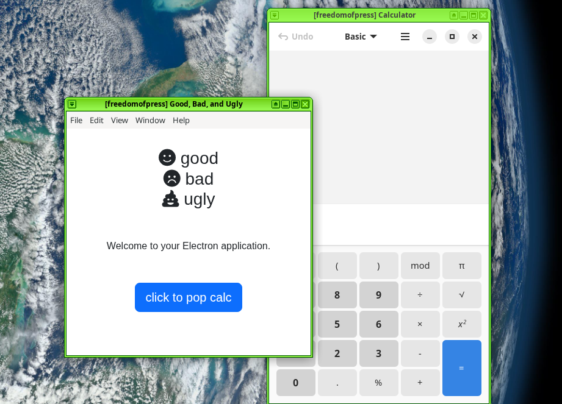

# Good, Bad, and Ugly



I installed node.js in my Fedora qube [like this](https://nodejs.org/en/download):

```sh
curl -o- https://raw.githubusercontent.com/nvm-sh/nvm/v0.40.3/install.sh | bash
# in a new tab
nvm install 22
```

I created this project with:

```sh
npx create-electron-app@latest electron-goodbadugly --template=vite-typescript
```

Here's the output:

```
$ npx create-electron-app@latest electron-goodbadugly --template=vite-typescript
Need to install the following packages:
create-electron-app@7.8.1
Ok to proceed? (y) y

npm warn skipping integrity check for git dependency ssh://git@github.com/electron/node-gyp.git
npm warn deprecated rimraf@3.0.2: Rimraf versions prior to v4 are no longer supported
npm warn deprecated @npmcli/move-file@2.0.1: This functionality has been moved to @npmcli/fs
npm warn deprecated inflight@1.0.6: This module is not supported, and leaks memory. Do not use it. Check out lru-cache if you want a good and tested way to coalesce async requests by a key value, which is much more comprehensive and powerful.
npm warn deprecated lodash.get@4.4.2: This package is deprecated. Use the optional chaining (?.) operator instead.
npm warn deprecated boolean@3.2.0: Package no longer supported. Contact Support at https://www.npmjs.com/support for more info.
npm warn deprecated glob@7.2.3: Glob versions prior to v9 are no longer supported
npm warn deprecated sudo-prompt@9.2.1: Package no longer supported. Contact Support at https://www.npmjs.com/support for more info.
npm warn deprecated glob@8.1.0: Glob versions prior to v9 are no longer supported
npm warn deprecated glob@8.1.0: Glob versions prior to v9 are no longer supported
✔ Resolving package manager: npm
✔ Resolving template: vite-typescript
  › Using @electron-forge/template-vite-typescript (local module)
✔ Initializing directory
✔ Initializing git repository
✔ Preparing template
✔ Initializing template
✔ Installing template dependencies
```

Make sure to install GNOME Calculator!

```sh
sudo dnf install gnome-calculator
```

`npm run` is sort of like Makefile. You can run the app like this:

```sh
npm run start
```
